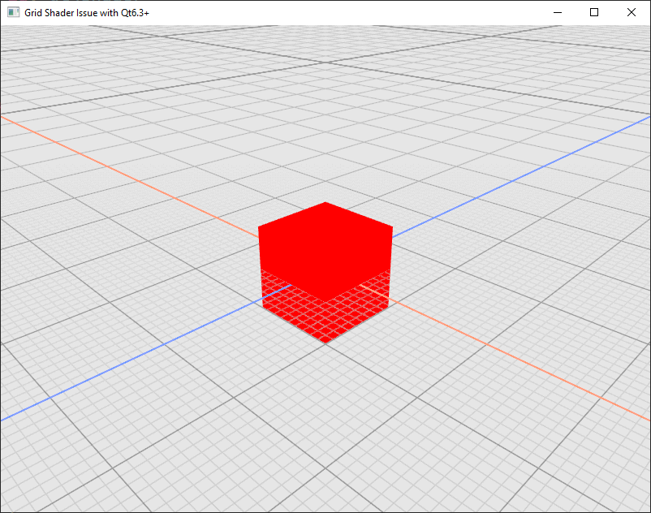

# Qt3DShaderIssue
Repository for sharing a supposed bug in Qt6.3+ when using custom shader in combination with Qt3D

The original shader of the infinite grid with explanations is available here:
http://asliceofrendering.com/scene%20helper/2020/01/05/InfiniteGrid/

## Qt6.2

## Qt6.3

